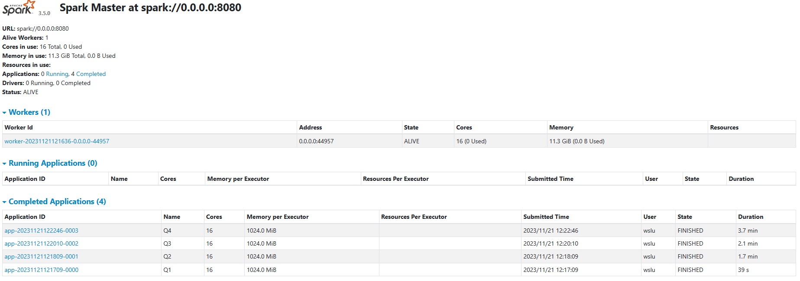
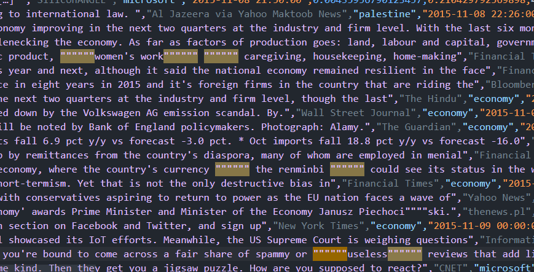
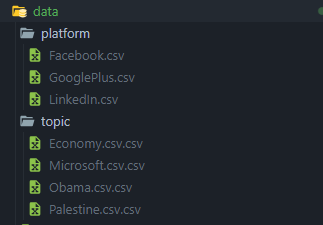

# Big-Data-Mining-HW-02
|||
|---|---|
|112598041 王衍斌|Q1, Q4, pre-processing|
|112598044 劉彥鴻|Q2, Q3, pre-processing|


## Usage
```bash
python3 q1_HW2.py
python3 q2_HW2.py
python3 q3_HW2.py
python3 q4_HW2.py
```

## Data Preprocessing
### Duplicated Quotations
\
remove the multiple duplicated """"""" in the Headline columns of News_final.csv.

### merge topics

use the pandas to merge platform and topic separately.
