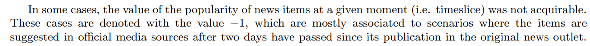

# Big-Data-Mining-HW-02

## Usage
```bash
python3 q1_HW4.py
python3 q2_HW4.py
python3 q4_HW4.py
```

## Data Preprocessing
### Duplicated Quotations
\
remove the multiple duplicated """"""" in the Headline columns of News_final.csv.

### merge topics

use the pandas to merge platform and topic separately.

### Q2, Q3
need to let all the value that is -1 change to 0.

source: https://www.techscience.com/cmc/v61n1/23099/pdf
